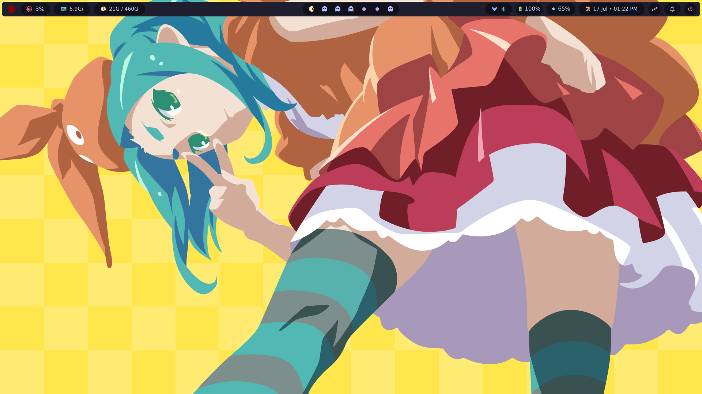
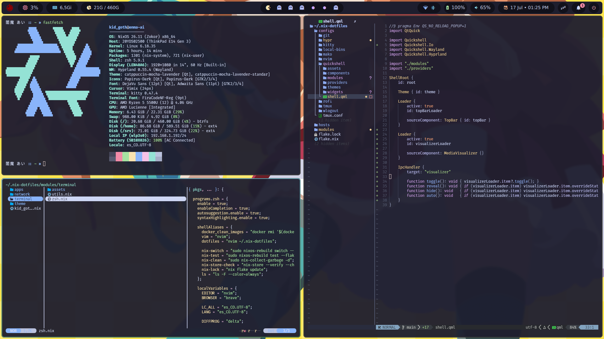
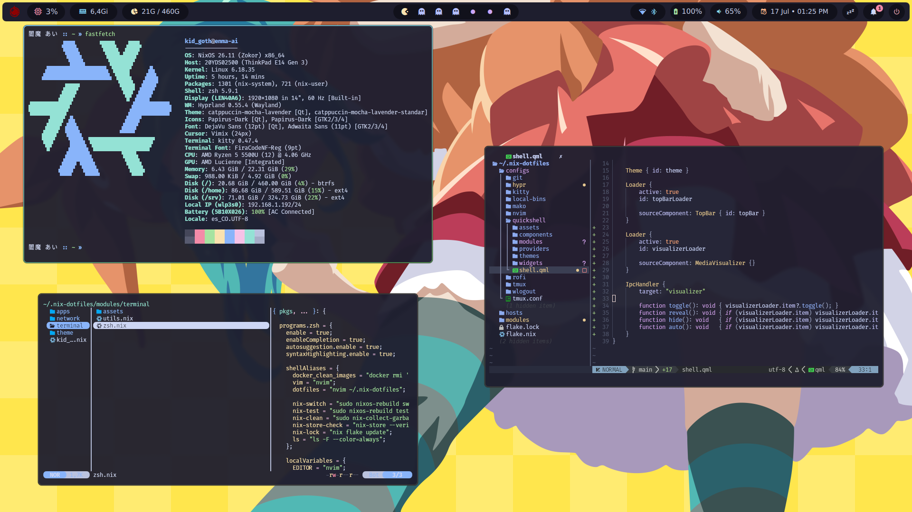
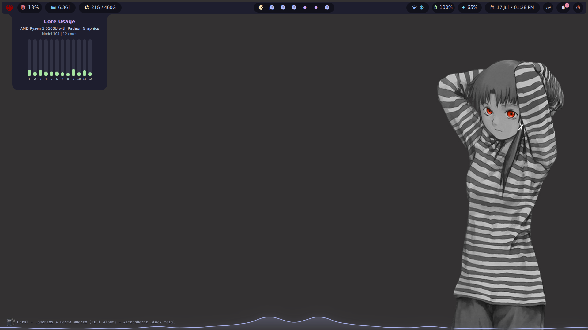
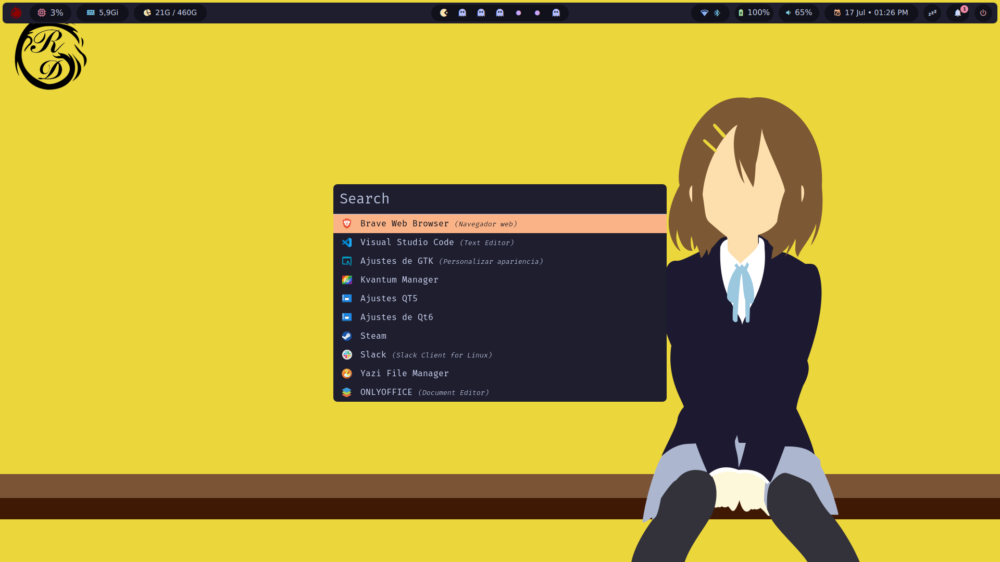
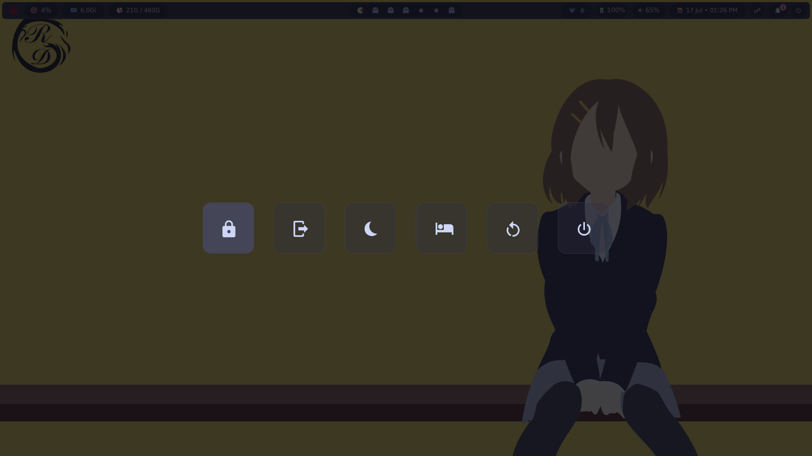

# NixOS [dot]files


## Shoots

| Clean desktop | Dwindle tiling | Pseudo-tiled windows |
|:---:|:---:|:---:|
|  |  |  |

| Quickshell widgets | Rofi launcher | Wlogout menu |
|:---:|:---:|:---:|
|  |  |  |

---

## Features

- **NixOS Flake** — Single `nixos-rebuild switch` deploys the entire OS, user env, and dotfiles. Reproducible. Immutable. Declarative.
- **Hyprland** — Tiling Wayland compositor configured in **Lua** with modular includes, per-monitor workspaces (hyprsplit), app freezer (SIGSTOP/SIGCONT), and dynamic layout toggling (dwindle ↔ scrolling).
- **Quickshell panel** — A fully custom top bar and system widgets written in **QML**, replacing Waybar. Includes per-core CPU bars, memory top-procs, disk pie charts, PipeWire volume, Bluetooth/WiFi popovers, notification history, Colombian holiday calendar, and a real-time audio visualizer.
- **Catppuccin Everything** — Every pixel of this system is bathed in Catppuccin Mocha (dark) or Latte (light). GTK, Qt/Kvantum, Kitty, Neovim, Rofi, Wlogout, Mako, Tmux, Hyprlock, and the Quickshell panel all consume the same color palette from a single source of truth.
- **Dynamic theme switching** — One command (`theme-switcher.sh`) flips between dark and light across **all** running applications simultaneously, via IPC, file sources, and live config reloads. Even hyprlock and the lockscreen colors update.
- **ZSH + powerline prompt** — Custom `enma-ai` theme with 閻魔 あい herself in the prompt, showing git status, virtualenv, and Node version. Oh-my-zsh, zoxide, fzf, syntax highlighting, autosuggestions.
- **Neovim** — Lazy.nvim, Catppuccin (frappe dark / latte), Treesitter (22 parsers), Mason LSP (12 servers), blink.cmp, Telescope, Copilot, conform autoformat, alpha dashboard.
- **Hyprsplit workspaces** — Each monitor has its own independent set of workspaces 1–10. No jumping across monitors when switching workspaces. Rogue window recovery on monitor disconnect.
- **Security** — Full disk LUKS2 encryption, systemd-boot, rootless Docker with IP forwarding.
- **Kill the anime aesthetic** — Hostname `enma-ai`, prompt in Japanese, subtle references throughout. The machine is named after the protagonist of *Jigoku Shoujo* (Hell Girl). Use `nix search` at your own risk.

---

## 🚀 Deployment

```bash
# Clone
git clone https://github.com/kid-goth/nix-dotfiles.git ~/.nix-dotfiles

# Rebuild (as root or with sudo)
sudo nixos-rebuild switch --flake ~/.nix-dotfiles#enma-ai

# Or just test the Home Manager changes
nix run home-manager -- switch --flake ~/.nix-dotfiles#kid_goth
```

> **Requirements**: NixOS with flakes enabled, `nix-command` and `flakes` experimental features.

---

## 🎨 Theme Switching

```bash
# Toggle between Catppuccin Mocha (dark) and Latte (light)
~/.config/local-bins/theme-switcher.sh
```

This single script propagates the theme change to:
| Component | Method |
|-----------|--------|
| GTK      | `gsettings` |
| Qt/Kvantum | Kvantum Manager CLI |
| Kitty    | `kitty @ set-colors` |
| Quickshell | File watch + QML signal |
| Hyprlock | Dynamic `source =` in config |
| Wlogout  | CSS file swap |
| Rofi     | Config file swap |
| Tmux     | TPM catppuccin set theme |

---

## ⌨️ Keybindings (SUPER = Windows key)

| Key | Action |
|-----|--------|
| `SUPER + Return` | Terminal (Kitty) |
| `SUPER + R` | Rofi launcher |
| `SUPER + [0-9]` | Switch workspace (per-monitor) |
| `SUPER + SHIFT + [0-9]` | Move window to workspace |
| `SUPER + SHIFT + C` | Close window |
| `SUPER + SHIFT + Q` | Quit Hyprland |
| `SUPER + SHIFT + T` | Toggle dwindle / scrolling layout |
| `SUPER + SHIFT + P` | Freeze/unfreeze app (SIGSTOP/SIGCONT) |
| `SUPER + V` | Cliphist clipboard picker |
| `SUPER + SHIFT + V` | Toggle media visualizer |
| `SUPER + L` | Lock screen |
| `SUPER + W` | Power menu (wlogout) |
| `SUPER + BackSpace` | File manager (pcmanfm) |
| `SUPER + G` | Recover rogue windows |
| `SUPER + S` | Scratchpad toggle |
| `Print` | Screenshot (region → grim + slurp) |
| `CTRL + Print` | Screenshot → clipboard |
| `SHIFT + Print` | Screenshot → swappy editor |

---

## 📜 License

MIT — use it, break it, fix it, share it.
